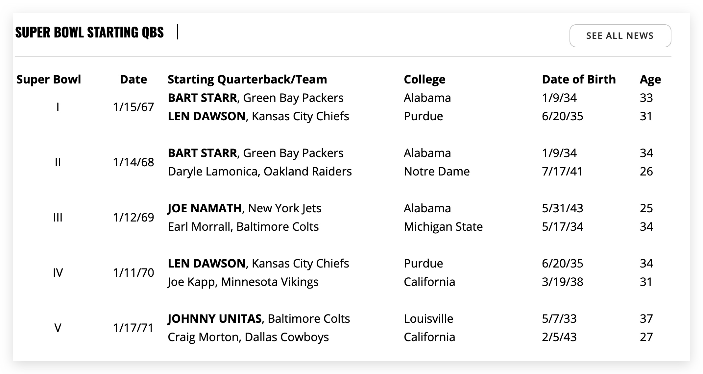

## ETL Project

**Team:** Meghan Luoma, Neal Tarver, John Forbis

**Extract:**
https://www.profootballhof.com/news/super-bowl-starting-qbs/
    Plan to grab the Super Bowl table regarding starting QB

https://www.pro-football-reference.com/leaders/pass_rating_career.htm
    Scrape the main table for QB passer rating

<ul>QB Passer Rating<ul>
<ul>Overall touchdowns<ul>
<ul>Interception %<ul>
<ul>Yards Per Attempt<ul>
<ul>Total Passing Yards<ul>
<ul>Completion %<ul>

We will use Splinter and Pandas to extract data.

**Transform:**
<ul>SQL</ul>

**Load:**
<ul>MongoBD</ul>
<ul>Postgres</ul>
