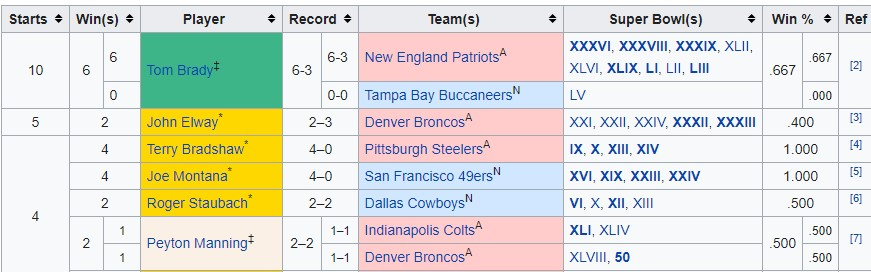
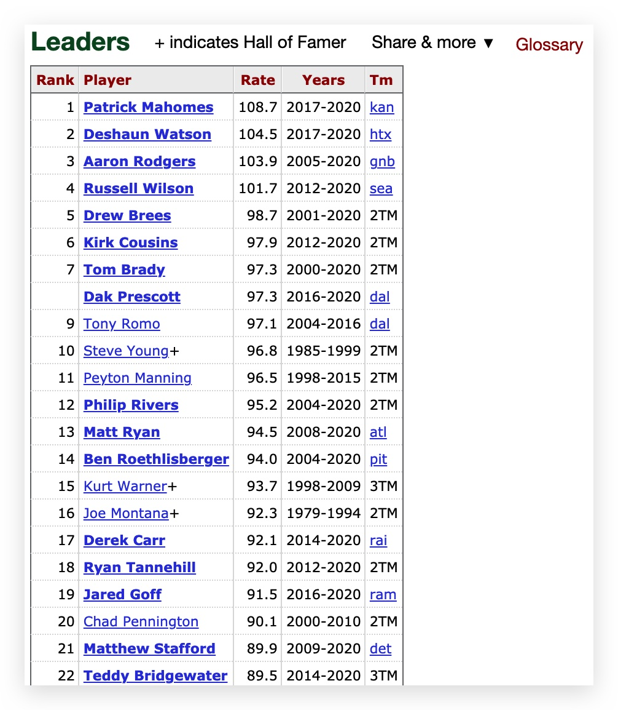

## ETL Project

**Team:** Meghan Luoma, Neal Tarver, John Forbis

**Extract:**
We scraped data from this webpage: https://en.wikipedia.org/wiki/List_of_Super_Bowl_starting_quarterbacks to determine the names of the starting quarterbacks from every super bowl. Then scraped this webpage: https://www.pro-football-reference.com/leaders/pass_rating_career.htm to pull data on quarterback passer rating, overall touchdowns, interception percent, yards per attempt, total passing yards and completion percent. We used Splinter and Pandas to scrape the webpages. We will use the combined data to predict how well the starting quarterback will play during the next super bowl. 

Wikipedia List:

Pro-Football Reference:

**Transform:**
We transformed the data we scraped using SQL, Pandas, Jupyter Notebook, Beautiful Soup and SQLAlchemy. 

**Load:**
We then loaded the data using Postgres.
